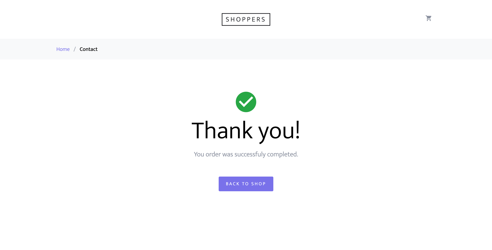

# Online Store

This project is a simple online store made for Software Engineering Fundamentals (CIE 460) University of Science and Technology - Zewail City.

- [Online Store](#online-store)
  - [Project Components](#project-components)
  - [How to run](#how-to-run)
  - [Screenshots](#screenshots)
    - [Home](#home)
    - [Product](#product)
    - [Cart](#cart)
    - [Checkout](#checkout)
    - [Login](#login)
    - [Register](#register)
    - [Admin](#admin)
    - [Create Product](#create-product)


## Project Components

- Front-end website:
  - Home screen
  - Product screen
  - Cart screen
  - Checkout screen
  - Login screen
  - Register screen
- Admin panel: For managing and adding products
- API: To enable the front-end to communicate with the backend

## How to run

1. Clone the repository
```bash
git clone https://github.com/abdelazizrashed/swe-store.git
```
2. Create a virtual environment
```bash
virtualenv venv
source venv/bin/activate
```
3. Install the requirements
```bash
pip install -r requirements.txt
```
4. Firebase
    1. Create a Firebase project
    2. Create a Firestore database
    3. Create a storage bucket
    4. Create a service account and download the json file
    5. Rename the json file to `firebase.json` and place it in the `app/logic/` directory of the project
    6. Update `storageBucket` in `app/logic/firestore_db.py` to your storage bucket address
```python
fb_app = firebase_admin.initialize_app(
    cred, {
        "storageBucket": "swe-store.appspot.com"
    }
)
```
1. Run the server
```bash
python run.py
```

## Screenshots

### Home


### Product


### Cart


### Checkout



### Login


### Register


### Admin


### Create Product


